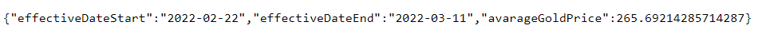
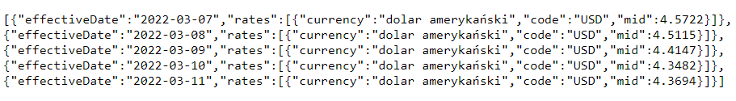

# NBP Service
Service using Java Spring framework like:
- lombok
- Web Spring

Also use:
- Feign (HTTP client binder)
- NBP API: [http://api.nbp.pl/en.html](http://api.nbp.pl/en.html)

### Requirements:
- Java 11

### Instalation step and run:
Colne github and run code!

## Local Development
To see results just run your browser and enter one of the link:

- [http://localhost:8080/api/gold-price/average](http://localhost:8080/api/gold-price/average)
  to display the average gold price for the last 14 business days.

- [http://localhost:8080/api/exchange-rates/{currencyCode}](http://localhost:8080/api/exchange-rates/USD)
  (e.g. USD) to display currency exchange rate PLN to {currencyCode} for the last 5 business days.

### Average gold price for the last 14 days

### Exchange rate for USD

